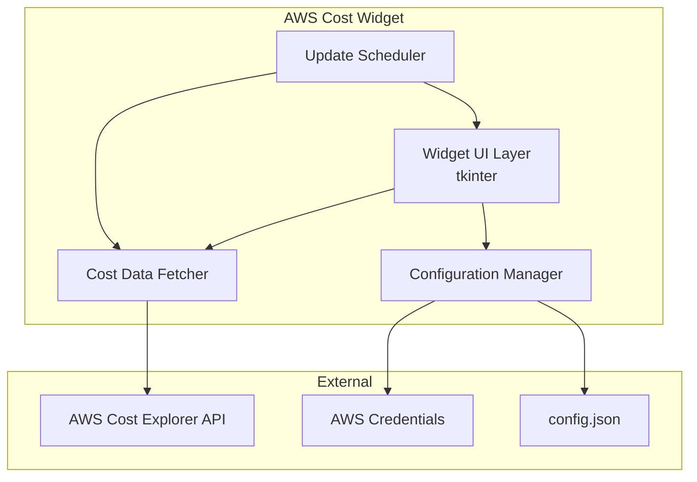
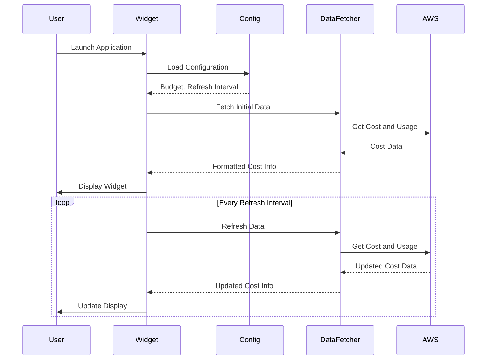

# Design Document

## Overview

The AWS Cost Widget is a lightweight, cross-platform Python desktop application that provides at-a-glance AWS spending visibility. Built using tkinter for GUI rendering, the widget displays month-to-date costs, a color-coded budget progress bar, and top spending services in a compact, draggable window that stays on top of other applications.

The application follows a modular architecture separating data fetching, configuration management, and UI rendering concerns. It uses boto3 for AWS Cost Explorer API integration and supports simulated data mode for testing and demonstration purposes.

## Architecture



### Component Flow



## Components and Interfaces

### 1. Configuration Manager (`config.py`)

Handles loading and validating application configuration.

```python
@dataclass
class WidgetConfig:
    budget: float  # Monthly budget in USD
    refresh_interval: int  # Seconds between updates (10-300)
    use_simulated_data: bool  # Use mock data instead of AWS API

def load_config(config_path: str = "config.json") -> WidgetConfig:
    """Load configuration from file, falling back to defaults."""
    pass

def validate_refresh_interval(interval: int) -> int:
    """Ensure interval is within 10-300 seconds range."""
    pass
```

### 2. Cost Data Fetcher (`cost_fetcher.py`)

Retrieves and formats AWS cost data.

```python
@dataclass
class CostData:
    month_to_date: float  # Total MTD cost in USD
    top_services: list[tuple[str, float, int]]  # [(service_name, cost, activity_count), ...]
    last_updated: datetime

def fetch_aws_costs() -> CostData:
    """Fetch real cost data from AWS Cost Explorer API."""
    pass

def fetch_simulated_costs() -> CostData:
    """Generate simulated cost data for testing."""
    pass

def fetch_service_activity(service_names: list[str]) -> dict[str, int]:
    """Fetch recent activity counts per service from CloudTrail."""
    pass

def format_currency(amount: float) -> str:
    """Format amount as currency string with $ symbol and 2 decimals."""
    pass
```

### 3. Widget UI (`widget.py`)

Main GUI component using tkinter.

```python
class AWSCostWidget:
    def __init__(self, config: WidgetConfig):
        """Initialize the widget window and components."""
        pass

    def update_display(self, cost_data: CostData) -> None:
        """Update all UI elements with new cost data."""
        pass

    def get_budget_color(self, percentage: float) -> str:
        """Return color based on budget consumption percentage."""
        pass

    def start_drag(self, event) -> None:
        """Begin drag operation, record initial position."""
        pass

    def do_drag(self, event) -> None:
        """Move widget during drag operation."""
        pass

    def run(self) -> None:
        """Start the tkinter main loop."""
        pass
```

### 4. Update Scheduler (`scheduler.py`)

Manages periodic data refresh.

```python
class UpdateScheduler:
    def __init__(self, widget: AWSCostWidget, fetcher: Callable, interval: int):
        """Initialize scheduler with widget, data fetcher, and interval."""
        pass

    def schedule_update(self) -> None:
        """Schedule the next data refresh."""
        pass

    def perform_update(self) -> None:
        """Fetch new data and update widget display."""
        pass
```

### 5. Main Entry Point (`main.py`)

Application bootstrap and orchestration.

```python
def main() -> None:
    """Initialize and run the AWS Cost Widget application."""
    pass
```

## Data Models

### CostData

| Field         | Type                         | Description                                   |
| ------------- | ---------------------------- | --------------------------------------------- |
| month_to_date | float                        | Total spending from month start to now        |
| top_services  | list[tuple[str, float, int]] | Up to 10 services with (name, cost, activity) |
| last_updated  | datetime                     | Timestamp of last data fetch                  |

### WidgetConfig

| Field              | Type  | Default | Description                      |
| ------------------ | ----- | ------- | -------------------------------- |
| budget             | float | 100.0   | Monthly budget limit in USD      |
| refresh_interval   | int   | 30      | Seconds between data refreshes   |
| use_simulated_data | bool  | False   | Use mock data instead of AWS API |

### Configuration File Format (config.json)

```json
{
  "budget": 100.0,
  "refresh_interval": 30,
  "use_simulated_data": false
}
```

## Correctness Properties

_A property is a characteristic or behavior that should hold true across all valid executions of a system-essentially, a formal statement about what the system should do. Properties serve as the bridge between human-readable specifications and machine-verifiable correctness guarantees._

Based on the prework analysis, the following properties can be combined and refined:

### Property Reflection

- Properties 2.2, 2.3, 2.4 (color thresholds) can be combined into a single comprehensive property about budget color selection
- Properties 3.1 and 3.2 (top services display) can be combined into one property about service list rendering
- Property 2.5 (progress bar fill) is subsumed by testing the percentage calculation itself

### Correctness Properties

**Property 1: Currency formatting consistency**
_For any_ non-negative float value, the format_currency function SHALL produce a string that starts with "$" and contains exactly two decimal places.
**Validates: Requirements 1.2**

**Property 2: Budget color threshold correctness**
_For any_ percentage value between 0 and 100+, the get_budget_color function SHALL return:

- "green" when percentage < 75
- "yellow" when 75 <= percentage <= 90
- "red" when percentage > 90
  **Validates: Requirements 2.2, 2.3, 2.4**

**Property 3: Top services list constraint**
_For any_ list of services with costs, the get_top_services function SHALL return at most 10 services, sorted by cost in descending order, where each entry contains both service name and cost.
**Validates: Requirements 3.1, 3.2**

**Property 4: Widget position boundary clamping**
_For any_ target position (x, y) and screen dimensions, the clamped position SHALL remain within visible screen boundaries (0 <= x <= screen_width - widget_width, 0 <= y <= screen_height - widget_height).
**Validates: Requirements 4.3**

**Property 5: Refresh interval validation**
_For any_ input interval value, the validate_refresh_interval function SHALL return a value within the range [10, 300] seconds.
**Validates: Requirements 5.3**

**Property 6: Configuration loading round-trip**
_For any_ valid WidgetConfig object, serializing to JSON and then loading SHALL produce an equivalent WidgetConfig object.
**Validates: Requirements 7.2**

## Error Handling

### Configuration Errors

| Error Condition        | Handling Strategy                            |
| ---------------------- | -------------------------------------------- |
| Config file not found  | Use default values (budget=100, interval=30) |
| Invalid JSON in config | Log warning, use defaults                    |
| Invalid interval value | Clamp to valid range [10, 300]               |
| Invalid budget value   | Use default budget of $100                   |

### AWS API Errors

| Error Condition     | Handling Strategy                               |
| ------------------- | ----------------------------------------------- |
| Missing credentials | Display error state with setup instructions     |
| Invalid credentials | Display authentication error message            |
| API rate limiting   | Retry with exponential backoff, show stale data |
| Network timeout     | Show last known data with "offline" indicator   |
| Permission denied   | Display IAM permission requirements             |

### UI Errors

| Error Condition                | Handling Strategy                   |
| ------------------------------ | ----------------------------------- |
| Display initialization failure | Log error, exit with message        |
| Widget drag outside screen     | Clamp position to screen boundaries |

## Testing Strategy

### Property-Based Testing

The project will use **Hypothesis** as the property-based testing library for Python. Each property test will run a minimum of 100 iterations.

Property-based tests will be implemented for:

1. Currency formatting (Property 1)
2. Budget color thresholds (Property 2)
3. Top services list constraints (Property 3)
4. Position boundary clamping (Property 4)
5. Refresh interval validation (Property 5)
6. Configuration round-trip (Property 6)

Each property test must be tagged with the format:
`**Feature: aws-cost-widget, Property {number}: {property_text}**`

### Unit Testing

Unit tests will use **pytest** and cover:

- Configuration loading with various file states
- Cost data fetching (mocked AWS responses)
- Simulated data generation
- Widget initialization
- Error state handling

### Test File Organization

```
tests/
├── test_config.py          # Configuration loading tests
├── test_cost_fetcher.py    # Cost fetching and formatting tests
├── test_widget.py          # Widget UI logic tests
├── test_properties.py      # Property-based tests
└── conftest.py             # Shared fixtures
```

### Testing Requirements

- All property-based tests must use Hypothesis with `@settings(max_examples=100)`
- Each property test must reference the correctness property it validates
- Unit tests verify specific examples and edge cases
- Property tests verify universal properties across all inputs
- Tests should not mock core logic being tested - only external dependencies (AWS API)
